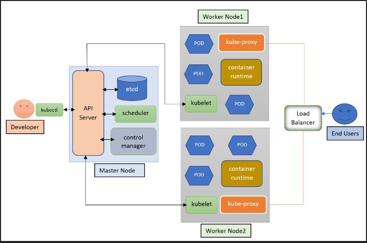

## Certified Kubernetes Administrator Coursework

This repo documents the labs and exercises I worked on while studying for the CKA certification

The courses that I took were [Linux Foundation]() and [Udemy]() in conjuction with kodekloud

What Is Kubernetes? - An open-source software for automating deployment, scaling, and management of containerized applications

Kubernetes is the Helmsman / pilot of a ship of containers.

Communication is entirely API call-driven, which allows for flexibility. Cluster configuration information is stored in a JSON format inside of etcd, but is most often written in YAML by the community. Kubernetes agents convert the YAML to JSON prior to persistence to the database.

Kubernetes Architecture              |  
:-------------------------:|
